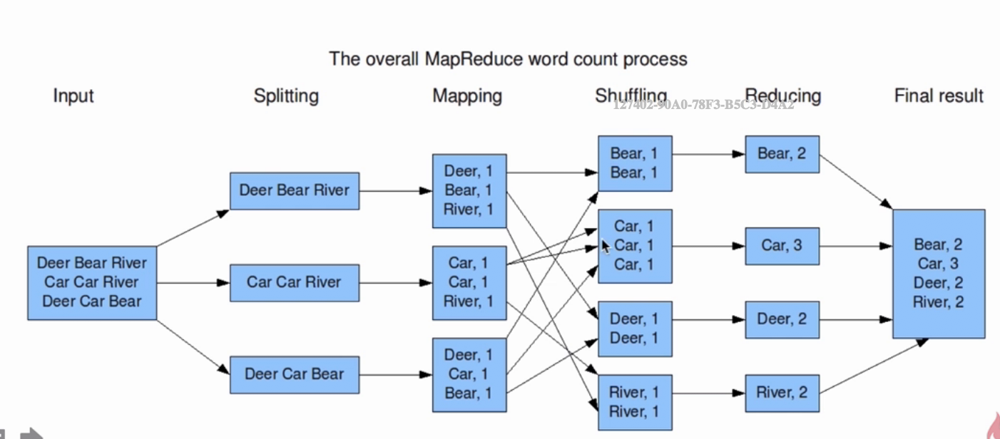
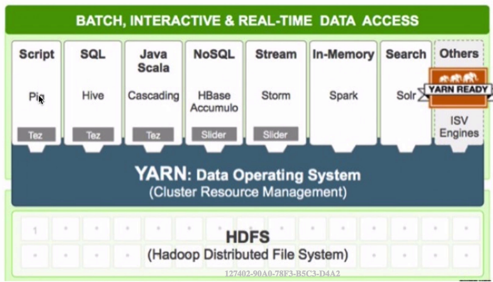

# hadoop学习笔记

## hadoop的组成部分

* 分布式文件系统: HDFS 实现将文件分布式存储在很多的服务器上

* 分布式计算框架： MapReduce实现在很多机器上进行分布式并行计算

* 分布式资源调度框架： YARN实现集群资源管理以及作业的调度

### HDFS

* 将文件切分成指定大小的数据块、并且以多副本的形式存放在多个机器上
  * test.log 200M
  * 默认block size为128M 所以有两个block block1 = 128M block2 = 72M
  * 默认三副本的形式存储 存储结果如下
    * node1: blk1 blk2
    * node2: blk2
    * node3: blk1
    * node4:
    * node5: blk1 blk2

* 数据切分、多副本、容错等操作过程对用户是透明的  用户不关注这个过程

### MapReduce

步骤分为input splitting mapping shuffing reducing和计算出final result

### YARN

* Yet Another Resource Negotiator
* 负责整个集群资源的管理和调度
* 多框架资源统一调度

### 去IoE

* 存储在廉价的机器上
